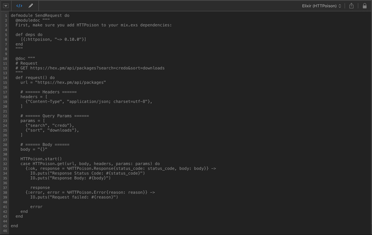

Elixir and HTTPosion Code Generator (Paw Extension)
===================================================

[](https://travis-ci.org/robottokauf3/Paw-ElixirHTTPosionCodeGenerator)

A [Paw Extension](https://paw.cloud/extensions/) to generate client code for Elixir using the [HTTPosion](https://github.com/edgurgel/httpoison) library.



## Installation

#### Clone this repository

```shell
git clone https://github.com/robottokauf3/Paw-ElixirHTTPosionCodeGenerator.git
```

#### Install Prerequisites

Use npm to install required packages:

```shell
npm install
```

#### Build and Install

Build the extension and install:

```shell
make install
```

## Development

#### Build

During development you can build the `.js` script separate from the install step if you wish:

```shell
make build
make install
```

#### Lint

Check for formatting and other errors:

```shell
make lint
```

#### Archive

Create `.zip` and `.tar.gz` archives of the extension:

```shell
make archive
```

## Author

Copyright © 2016 Robert Kaufmann III.

## License

ExOrg is released under the [MIT License](LICENSE.md).
